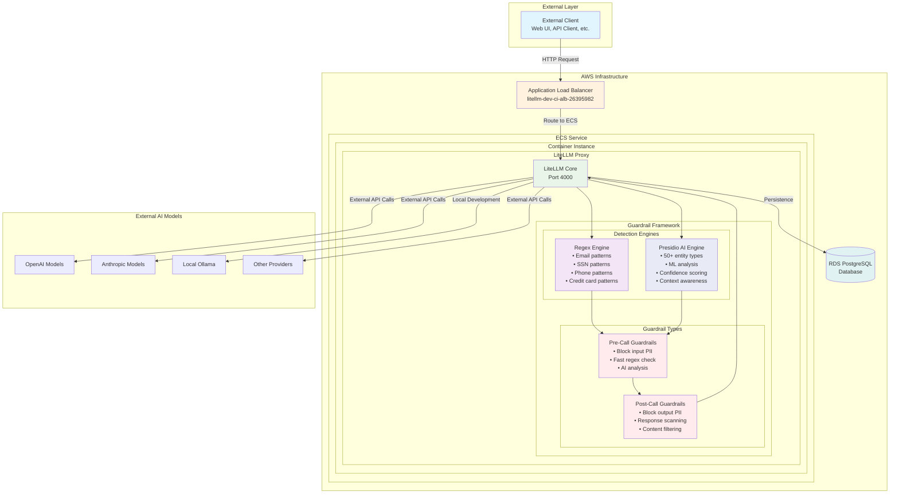
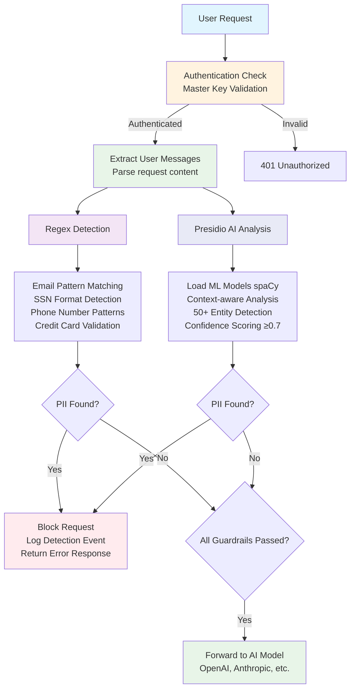
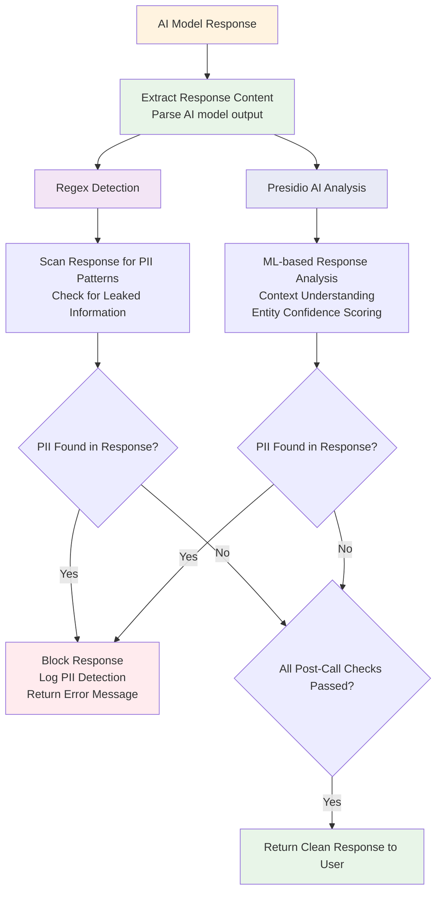

# LiteLLM PII Guardrails Architecture

Detailed architecture documentation for the dual PII detection system implemented in this repository.

## High-Level System Architecture



## Request Processing Flow

### Pre-Call Guardrail Flow


### Post-Call Guardrail Flow


## Code Architecture

### Class Hierarchy
```
CustomGuardrail (LiteLLM Base Class)
├── PIIRegexPreCallGuardrail
├── PIIRegexPostCallGuardrail  
├── PIIPresidioPreCallGuardrail
└── PIIPresidioPostCallGuardrail

Detection Engines (Shared Logic)
├── PIIRegexDetection
│   ├── email_pattern
│   ├── ssn_pattern
│   ├── phone_pattern
│   └── credit_card_pattern
└── PIIPresidioDetection
    ├── analyzer (AnalyzerEngine)
    ├── entities (50+ types)
    └── confidence_threshold
```

### File Organization
```
litellm-app/
├── Dockerfile                          # Container build with dependencies
├── litellm-config.yaml                 # Guardrail configuration
│
├── pii_regex_detection.py              # Shared regex patterns
├── pii_regex_precall.py                # Regex pre-call guardrail
├── pii_regex_postcall.py               # Regex post-call guardrail
│
├── pii_presidio_detection.py           # Shared AI detection logic
├── pii_presidio_precall.py             # Presidio pre-call guardrail
├── pii_presidio_postcall.py            # Presidio post-call guardrail
│
└── tests/                              # Comprehensive test collections
    ├── test_regex.http                 # Regex guardrail tests
    ├── test_presidio.http              # Presidio guardrail tests
    └── test_regex.py                   # Automated Python tests
```

## Configuration Architecture

### Guardrail Registration
```yaml
# litellm-config.yaml
guardrails:
  # Fast regex-based detection
  - guardrail_name: "pii-regex-precall"
    litellm_params:
      guardrail: pii_regex_precall.PIIRegexPreCallGuardrail
      mode: "pre_call"
      
  # Comprehensive AI-based detection  
  - guardrail_name: "pii-presidio-precall"
    litellm_params:
      guardrail: pii_presidio_precall.PIIPresidioPreCallGuardrail
      mode: "pre_call"
      language: "en"
      threshold: 0.7
      block_on_detection: true
```

### Runtime Activation
```bash
# API request with specific guardrails
curl -X POST /v1/chat/completions \
  -H "Authorization: Bearer key" \
  -d '{
    "model": "llama3.2-3b",
    "messages": [{"role": "user", "content": "test@example.com"}],
    "guardrails": ["pii-regex-precall", "pii-presidio-precall"]
  }'
```

## Deployment Architecture

### Development Environment
```
Docker Compose Stack:
├── LiteLLM Container (with embedded guardrails)
├── Ollama Container (local AI models)
├── PostgreSQL Container (persistence)
└── Shared Network (inter-service communication)
```

### Production Environment  
```
AWS Infrastructure:
├── Application Load Balancer (public endpoint)
├── ECS Service (auto-scaling containers)
│   └── LiteLLM Tasks (embedded guardrails)
├── RDS PostgreSQL (managed database)
└── ECR Registry (container images)
```

### CI/CD Pipeline
```
GitHub Repository → GitHub Actions → ECR Registry → Repository Dispatch → Infrastructure Deployment

litellm-app repo:
├── Code changes detected (path-based triggering)
├── Multi-platform container build (amd64/arm64)
├── Security scanning and testing
├── Push to ECR with dual tags (latest + commit-sha)
└── Trigger infrastructure deployment

litellm-infra repo:
├── Receive repository dispatch event
├── Extract new container image URI
├── Update Terraform configuration
├── Deploy to ECS with zero-downtime
└── Verify deployment health
```

## Security Architecture

### Container Security
```
Security Layers:
├── Minimal base image (LiteLLM official)
├── Non-root execution (where possible)
├── Comprehensive .dockerignore (test/doc exclusion)
├── Health checks (200/401 acceptance)
├── Multi-platform builds (consistent security)
└── Dependency scanning (automated)
```

### PII Protection Layers
```
Defense in Depth:
├── Input Validation (pre-call guardrails)
├── Output Filtering (post-call guardrails)  
├── Dual Detection (regex + AI)
├── Configurable Sensitivity (confidence thresholds)
├── Audit Logging (security events)
└── Fail-Safe Blocking (default deny)
```

## Performance Characteristics

### Regex Guardrails
- **Latency**: Sub-millisecond detection
- **Throughput**: High (minimal CPU overhead)
- **Accuracy**: High for known patterns
- **Use Case**: High-volume, performance-critical applications

### Presidio AI Guardrails  
- **Latency**: ~10-50ms additional processing
- **Throughput**: Moderate (ML model overhead)
- **Accuracy**: Very high with context awareness
- **Use Case**: Security-critical applications requiring comprehensive coverage

### Combined System
- **Layered Protection**: Fast regex + comprehensive AI
- **Configurable**: Enable/disable individual guardrails
- **Scalable**: ECS auto-scaling based on demand
- **Monitored**: Health checks and error tracking